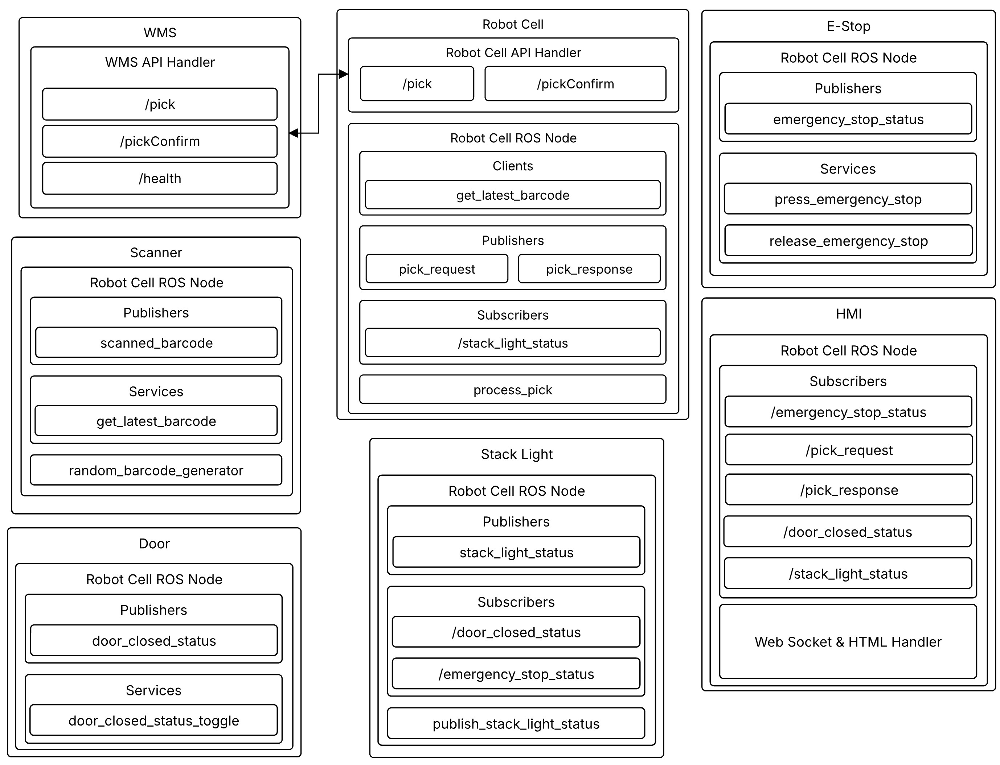
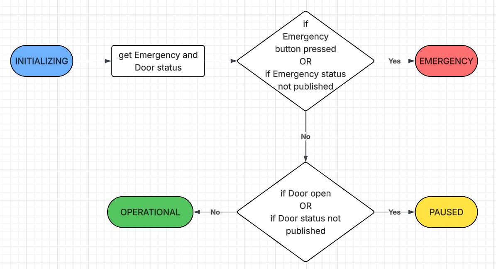
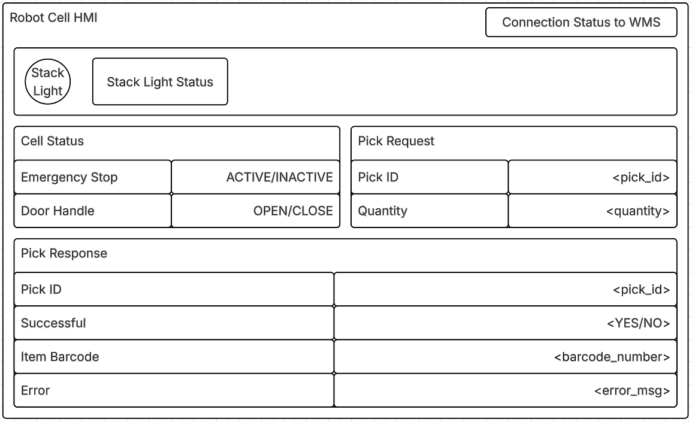
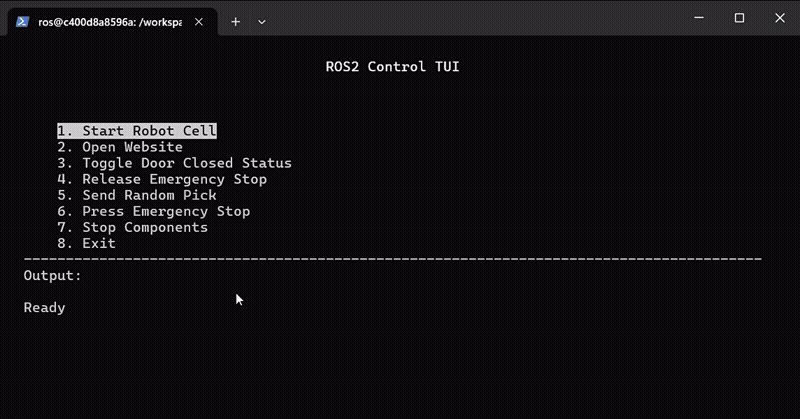
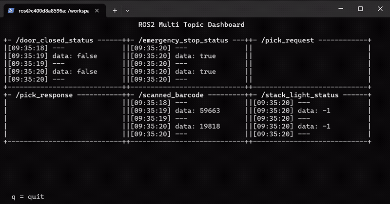

# Sereact Challenge
Simple simulated bin pick robot cell system

## Prerequisites
- Docker


## Architecture
<p align="center">

</p>

## Stack Light Logic
<p align="center">

</p>


## Initial UI
<p align="center">

</p>

## Tested Platforms
- Windows 11 with Docker desktop
- Ubuntu 22.04 (WSL on Windows 11)
- Ubuntu 22.04s

## Install
```
git clone https://github.com/josephjoel3099/sereact_challenge.git
```

## Run
### On Windows
```
cd sereact_challenge
```
```
docker build -t sereact_challenge -f .devcontainer/Dockerfile .
```
```
docker run -it --rm `
--ipc=host `
--privileged `
-e ROS_DOMAIN_ID=0 `
-e RMW_IMPLEMENTATION=rmw_cyclonedds_cpp `
-v ${PWD}:/workspaces/ws_sereact `
-w /workspaces/ws_sereact `
-p 8082:8082 `
--user ros `
sereact_challenge `
bash -c "bash .devcontainer/post_create.sh && /bin/bash"
```
```
python3 scripts/helper_tui.py
```

### On VS Code
1. Open cloned repository.
2. Open in container.
3. Open a new terminal.
4. Launch TUI:
    ```
    python3 scripts/helper_tui.py
    ```

### On Linux
```
cd sereact_challenge
```
```
docker build -t sereact_challenge -f .devcontainer/Dockerfile .
```
```
docker run -it --rm \
  --network=host \
  --ipc=host \
  --privileged \
  -e ROS_DOMAIN_ID=0 \
  -e RMW_IMPLEMENTATION=rmw_cyclonedds_cpp \
  -v $(pwd):/workspaces/ws_sereact \
  -w /workspaces/ws_sereact \
  --user ros \
  sereact_challenge \
  bash -c "bash .devcontainer/post_create.sh && /bin/bash"
```
```
python3 scripts/helper_tui.py
```

## Using the TUI
To make launching and running commands easy
### UI
<p align="center">

</p>

### Controls
- Move: Arrow Keys (↑ ↓)
- Select: Enter
- Exit: Ctrl+C or Q/q

### Note
| Option | Action | Note |
| :------: | ------ | ---- |
| 1. | Start Robot Cell | Statrt all ROS nodes |
| 2. | Open Website | Open HMI on browser |
| 3. | Toggle Door Closed Status | 
| 4. | Release Emergency Stop |
| 5. | Send Random Pick |
| 6. | Press Emergency Stop |
| 7. | Stop Components |
| 8. | Exit | Will not stop ROS nodes

## HMI
Hosted at: http://localhost:8082/

> [!NOTE]
> Requires node "hmi" running

### Disclaimer
Actions may be slow especially ROS ones since they are running through a subprocess. This is only for development/early concept stage.

## Additional details
| Node | Topics | Services |
|------|--------|----------|
| `/door` | `/door_closed_status` | `/door_closed_status_toggle` |
| `/emergency_stop` | `/emergency_stop_status` | `/press_emergency_stop` <br> `/release_emergency_stop` |
| `/hmi` | — | — |
| `/robot_cell_client` | `/pick_request` <br> `/pick_response` | — |
| `/scanner` | `/scanned_barcode` | `/get_latest_barcode` |
| `/stack_light` | `/stack_light_status` | — |

## Video
<p align="center">
<video width="820" height="540" controls>
  <source src="docs/video.mp4" type="video/mp4">
</video>
</p>

## Degug TUI
To inspect ROS topics
<p align="center">

</p>

### Useful links
- [FastAPI](https://fastapi.tiangolo.com/)
- [Uvicorn](https://fastapi.tiangolo.com/deployment/server-workers/?h=uvicorn)
- [LucidChart](https://www.lucidchart.com/pages)

## License
MIT License

Copyright (c) 2026 Joseph Joel

Permission is hereby granted, free of charge, to any person obtaining a copy
of this software and associated documentation files (the "Software"), to deal
in the Software without restriction, including without limitation the rights
to use, copy, modify, merge, publish, distribute, sublicense, and/or sell
copies of the Software, and to permit persons to whom the Software is
furnished to do so, subject to the following conditions:

The above copyright notice and this permission notice shall be included in all
copies or substantial portions of the Software.

THE SOFTWARE IS PROVIDED "AS IS", WITHOUT WARRANTY OF ANY KIND, EXPRESS OR
IMPLIED, INCLUDING BUT NOT LIMITED TO THE WARRANTIES OF MERCHANTABILITY,
FITNESS FOR A PARTICULAR PURPOSE AND NONINFRINGEMENT. IN NO EVENT SHALL THE
AUTHORS OR COPYRIGHT HOLDERS BE LIABLE FOR ANY CLAIM, DAMAGES OR OTHER
LIABILITY, WHETHER IN AN ACTION OF CONTRACT, TORT OR OTHERWISE, ARISING FROM,
OUT OF OR IN CONNECTION WITH THE SOFTWARE OR THE USE OR OTHER DEALINGS IN THE
SOFTWARE.
